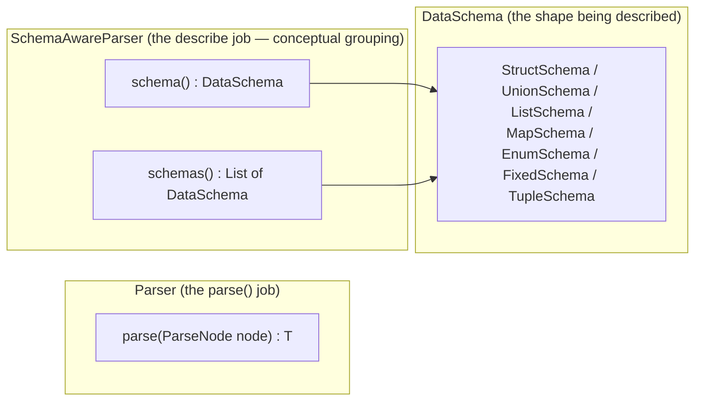
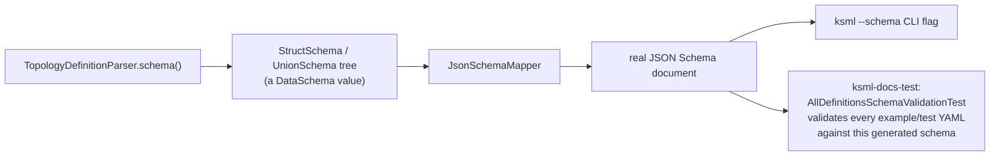
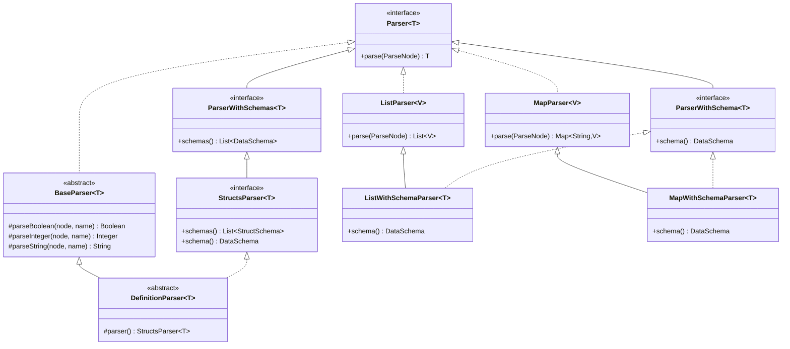
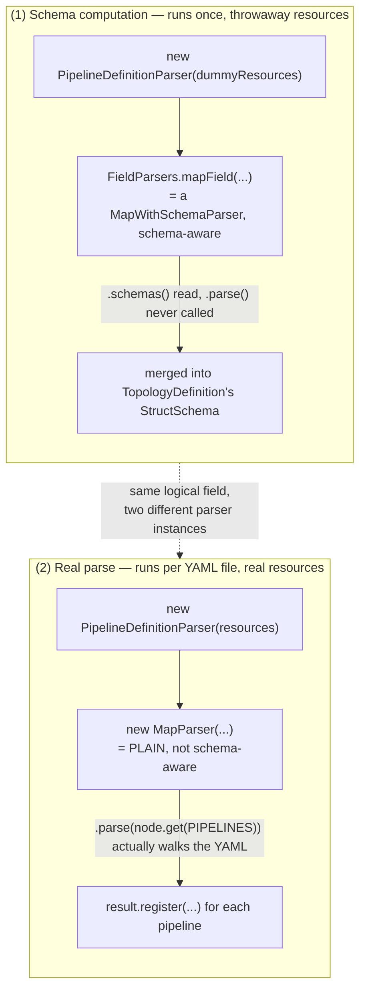

# Parser Architecture: `parse()`, `schema()`, and `DataSchema`

This note explains the core parsing abstractions in `io.axual.ksml.parser` (and friends):
what `parse()` and `schema()`/`schemas()` are for, where they come from, why some parsers
have one and not the other, and how a single top-level call — `TopologyDefinitionParser`
parsing a KSML YAML file — uses both capabilities together to (a) parse a definition and
(b) produce the JSON Schema used to validate and document the KSML language.

## 1. The three abstractions, at a glance

Every parser in this codebase does at most two independent jobs:

- **Parse**: given actual input (a `ParseNode`), produce a value of type `T`.
- **Describe**: independent of any input, report the *shape* of the `T` it produces, as a
  `DataSchema` value.



"SchemaAwareParser" isn't a literal class in the codebase — it's the conceptual name for
*whichever* interface adds a `schema()`/`schemas()` method on top of `Parser<T>`. Concretely,
that's `ParserWithSchema<T>` (one schema) or `ParserWithSchemas<T>` (a list of schemas); see
§3. A concrete parser class either only implements `Parser<T>` (parse-only), or additionally
implements one of those two (schema-aware).

## 2. `Parser<T>` — the parse contract

```java
public interface Parser<T> {
    T parse(ParseNode node);
}
```

This is the root of everything. `ParseNode` is a thin wrapper around Jackson's `JsonNode`
(plus a parent chain for error-path reporting, e.g. `stream->pipelines->filter`). A
`Parser<T>` is a black box: the only way to learn what it accepts is to feed it input and see
whether it throws.

Two plain, non-schema-aware implementations of `Parser<T>` matter here:

- **`BaseParser<T>`** — abstract class. Adds three `protected` scalar-extraction helpers
  (`parseBoolean`, `parseInteger`, `parseString`) for pulling a named, typed child value off a
  `ParseNode`. No `schema()` of any kind.
- **`ListParser<V>` / `MapParser<V>`** — concrete, generic classes, siblings of each other.
  Each wraps one child `Parser<V> valueParser` plus a couple of tag-key strings, and repeatedly
  delegates to that child over `node.children(...)`, collecting results into a `List` (ordered,
  errors reported by index) or a `LinkedHashMap` (insertion-order preserved, errors reported by
  child name). Neither has a `schema()`/`schemas()` — they only know how to iterate and
  delegate.

## 3. `ParserWithSchema<T>` and `ParserWithSchemas<T>` — the describe contract

Two independent interfaces, **not** one extending the other, both extending `Parser<T>`
directly:

```java
public interface ParserWithSchema<T> extends Parser<T> {
    DataSchema schema();               // exactly one shape
}

public interface ParserWithSchemas<T> extends Parser<T> {
    List<? extends DataSchema> schemas();   // possibly several alternative shapes
}
```

Both are otherwise inert: no parsing logic of their own beyond the inherited `parse()`, plus a
static `of(...)` factory for building a simple instance from a lambda and a schema (or a
supplier of one). They exist as two parallel shapes because some values genuinely have one
possible shape (a plain string field) and some can validly take several alternatives at once
(an optional field, or a union type) — `ParserWithSchemas` avoids forcing the single-shape case
through list-wrapper overhead by being a distinct sibling rather than "the plural is a special
case of the singular."

**Because `schema()`/`schemas()` are abstract interface methods, any concrete class that
implements one of these interfaces is *required* by the compiler to provide both the parse
logic and the describe logic.** There's no such thing as a class that "sort of" implements
`ParserWithSchema` — implementing it at all means both methods exist. That's why, for the
subset of parsers that are schema-aware, "does both parse and describe" isn't a convention,
it's structurally guaranteed.

`StructsParser<T>` — the interface almost everything in `DefinitionParser`/`FieldParsers` is
built around — `extends ParserWithSchemas<T>` and narrows `schemas()`'s return type to
`List<StructSchema>` specifically (a legal covariant override, since `List<StructSchema>` is a
subtype of `List<? extends DataSchema>`), and adds a default `schema()` that returns the single
schema directly if there's only one, or wraps several in a `UnionSchema` otherwise.

## 4. `DataSchema` — what the shape actually *is*

`DataSchema` is a small sealed family of value types describing a shape, independent of any
Java type or any specific piece of input:

| Type           | Describes                                                         |
|----------------|--------------------------------------------------------------------|
| `StructSchema` | A named object with typed, optionally-required, documented fields |
| `UnionSchema`  | "one of these alternative schemas"                                 |
| `ListSchema`   | A homogeneous list of some element schema                          |
| `MapSchema`    | A homogeneous map of some value schema, keyed by name              |
| `EnumSchema`   | A fixed set of named symbols                                        |
| `FixedSchema`  | A fixed-length byte sequence                                        |
| `TupleSchema`  | A fixed-arity heterogeneous sequence                                 |

A `DataSchema` value carries no parsing behavior — it's pure data, safely inspectable and
serializable. That's what makes it the right thing for `schema()`/`schemas()` to return: the
description can be extracted, combined, and converted **without ever calling `parse()`**.

### Where `schema()` gets its information from

Every field-builder method in `FieldParsers` (`stringField`, `booleanField`, `listField`,
`structsParser(...)`, etc.) builds **both** halves from the same declaration at the same time:
a parse function *and* a `DataSchema` fragment (name, type, doc string, tag, required/optional,
union alternatives). `structsParser(...)` combines several such (parser, schema) pairs into one
combined `StructsParser<T>` whose `schemas()` merges the individual field schemas into one
`StructSchema`. So a class's `schema()`/`schemas()` output isn't computed by inspecting the
class or by reflection — it's built up field-by-field, at construction time, out of the exact
same declarations that also produce the parse behavior. That's the "parse ⊗ describe"
combinator design: the two can never drift apart because they're two views of one declaration.

### What the `DataSchema` tree is used for



`JsonSchemaMapper` walks the `DataSchema` tree and emits an actual JSON Schema document. That
document is what `ksml --schema` prints, and what `ksml-docs-test` uses to validate every
example/test KSML YAML file — generated from the exact same parser code that does the real
parsing, so the two can't drift.

## 5. Class/interface map



Reading this: `BaseParser`, `ListParser`, `MapParser` are parse-only. `ParserWithSchema` and
`ParserWithSchemas` are independent, parse+describe contracts. `StructsParser` is the
plural-schema contract, narrowed to `StructSchema` specifically, that the whole KSML-definition
parsing hierarchy (`DefinitionParser` and everything under it) is built on. `ListWithSchemaParser`
/ `MapWithSchemaParser` show the one place a plain collection parser gets upgraded to
schema-aware by subclassing and additionally implementing `ParserWithSchema`.

## 6. The role of plain (parse-only) parsers

Plain parsers show up for two different reasons, not one:

**Reason A — mechanical "iterate and dispatch" glue, where the shape is already known.**
Within the schema-aware `DefinitionParser` lineage, a plain `ListParser`/`MapParser` sometimes
appears wrapping an already schema-aware value parser, purely to walk a YAML list/map and
delegate each entry — because the *container's* schema was already computed separately,
elsewhere, and recomputing it here would be redundant. See §7 for the concrete example.

**Reason B — an entire sub-language that has no schema at all.** The
`io.axual.ksml.schema.parser.*` package (which parses the schema-*definition* DSL itself — the
format used to declare KSML struct/enum/union types) extends `BaseParser` directly, not
`DefinitionParser`, and uses plain `ListParser`/`MapParser` throughout. There's no
"schema of a schema declaration" being generated for that sub-language, so schema-awareness
never enters the picture there at all.

## 7. Worked example: `TopologyDefinitionParser`

`TopologyDefinitionParser` is the root parser for an entire KSML YAML definition. Its
`parser()` method does two genuinely separate things, computed at two different times, using
two different parser instances for the same logical content:

```java
public StructsParser<TopologyDefinition> parser() {
    final var dummyResources = new TopologyResources("dummy");
    // (1) SCHEMA computation — runs once, uses a throwaway empty TopologyResources.
    //     parse() is never called on these instances; only .schemas() is read.
    final var pipelinesParser = FieldParsers.optional(FieldParsers.mapField(
            PIPELINES, PIPELINE, PIPELINE, "Collection of named pipelines",
            new PipelineDefinitionParser(dummyResources)));
    final var producersParser = FieldParsers.optional(FieldParsers.mapField(
            PRODUCERS, PRODUCER, PRODUCER, "Collection of named producers",
            new ProducerDefinitionParser(dummyResources)));

    final var fields = resourcesParser.schemas().getFirst().fields();
    fields.addAll(pipelinesParser.schemas().getFirst().fields());
    fields.addAll(producersParser.schemas().getFirst().fields());
    final var schemas = List.of(FieldParsers.structSchema(TopologyDefinition.class, "KSML definition", fields));

    return new StructsParser<>() {
        @Override
        public TopologyDefinition parse(ParseNode node) {
            // (2) REAL parse — runs per actual YAML file, uses the real resources.
            final var resources = resourcesParser.parse(node);
            final var result = new TopologyDefinition(resources.namespace(), ...);
            resources.topics().forEach(result::register);
            resources.stateStores().forEach(result::register);
            resources.functions().forEach(result::register);
            // A fresh, PLAIN MapParser does the actual iteration + dispatch:
            new MapParser<>(PIPELINE, "pipeline definition", new PipelineDefinitionParser(resources))
                    .parse(node.get(PIPELINES)).forEach(result::register);
            new MapParser<>(PRODUCER, "producer definition", new ProducerDefinitionParser(resources))
                    .parse(node.get(PRODUCERS)).forEach(result::register);
            return result;
        }

        @Override
        public List<StructSchema> schemas() {
            return schemas;
        }
    };
}
```



The value parser passed into both (`PipelineDefinitionParser`) is schema-aware either way — the
field-level semantics (what a pipeline contains, its types, docs, validation) are always
implemented by schema-aware parsers, because that's the only mechanism that produces a
`DataSchema` at all. The difference is only in the *outer wrapper*: `mapField` (schema-aware,
used once to describe the "pipelines" container) versus a plain `MapParser` (used every time,
to actually walk it). This is why plain parsers "play a role" in real parsing without being
where the real work happens: they're the mechanical last mile between a container node and its
already-described, already-schema-aware children.

## 8. Summary

| | `parse()` | `schema()` / `schemas()` |
|---|---|---|
| `Parser<T>` | ✓ (the only thing it has) | — |
| `BaseParser`, `ListParser`, `MapParser` | ✓ | — |
| `ParserWithSchema<T>` | ✓ (inherited) | ✓ (exactly one `DataSchema`) |
| `ParserWithSchemas<T>` | ✓ (inherited) | ✓ (a list of `DataSchema`) |
| `StructsParser<T>` | ✓ (inherited) | ✓ (`List<StructSchema>`, plus default `schema()`) |
| `ListWithSchemaParser`, `MapWithSchemaParser` | ✓ (inherited from `ListParser`/`MapParser`) | ✓ (`ParserWithSchema`) |
| `DefinitionParser<T>` and everything under it (`FieldParsers`-built parsers, all KSML definition/operation parsers) | ✓ | ✓ |
| `io.axual.ksml.schema.parser.*` (the schema-definition DSL) | ✓ | — (no schema-of-a-schema is ever produced) |

The one-line version: **`parse()` turns real input into a value; `schema()`/`schemas()`
describes, independent of input, what shape that value takes, as a `DataSchema`; and that
`DataSchema` tree is what `JsonSchemaMapper` turns into the real JSON Schema behind
`ksml --schema` and `ksml-docs-test`.** Plain parsers exist wherever only the first half is
needed — either as thin iterate-and-dispatch glue around already-described children, or in an
entire sub-language (the schema-definition DSL) that was never meant to describe itself.
